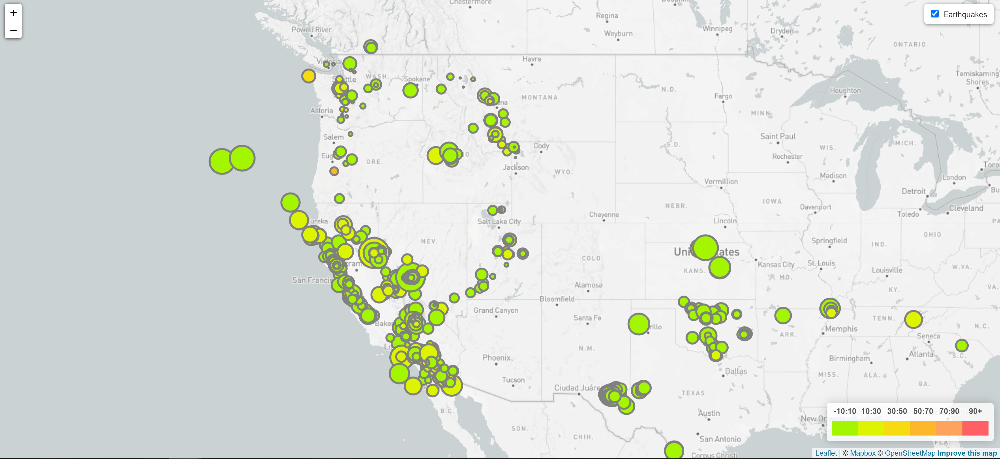
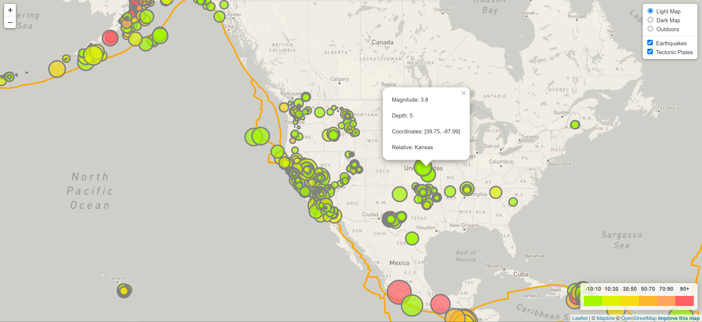

# Mapping-Earthquakes
This project was designed to call data on earthquakes and plot them on a map using the javascript leaflet library. For an extra step tectonic plates were added.

# To Run The Map
1. Open code with VS code
1. Put your MapBox token (api key) into a config.js file in the static/js folder.
1. Launch `index.html` with live server.
1. Have Fun!

# Leaflet-Step-1 Features
### Earthquake Layer
* Every circle on the map represents an earthquake in the last 7-days.
* Depth is shown on the map by color and there is a legend in the lower right corner that shows the scale.
* Magnitude is shown in the size of the circle, scaled to make map aestheticllh pleasing.
* Each earthquake/circle, if clicked, will have a popup. This pop up tell you the magnitude, depth, coordinates and relative location.

# Leaflet-Step-2 Features
### Control
* You have three map background options you can toggle between, light, dark, and outdoors.
* You can also turn ON/OFF the earthquake and tectonic layers.
### Earthquake Layer
* Every circle on the map represents an earthquake in the last 7-days.
* Depth is shown on the map by color and there is a legend in the lower right corner that shows the scale.
* Magnitude is shown in the size of the circle, scaled to make map aestheticllh pleasing.
* Each earthquake/circle, if clicked, will have a popup. This pop up tell you the magnitude, depth, coordinates, and relative location.
### Tectonic Layer
* Lines that represent the boundries between the earths tectonic plates.
* If you click anywhere on the map, that is not an earthquake circle, a popup with show up. This will tell you the name of the plate you clicked on.
### Toggling
* To ensure that the tectonic layer is not covering up the earthquake layer when you are toggling layers, make sure you turn on earthquakes last if you want to be able to click on them.
